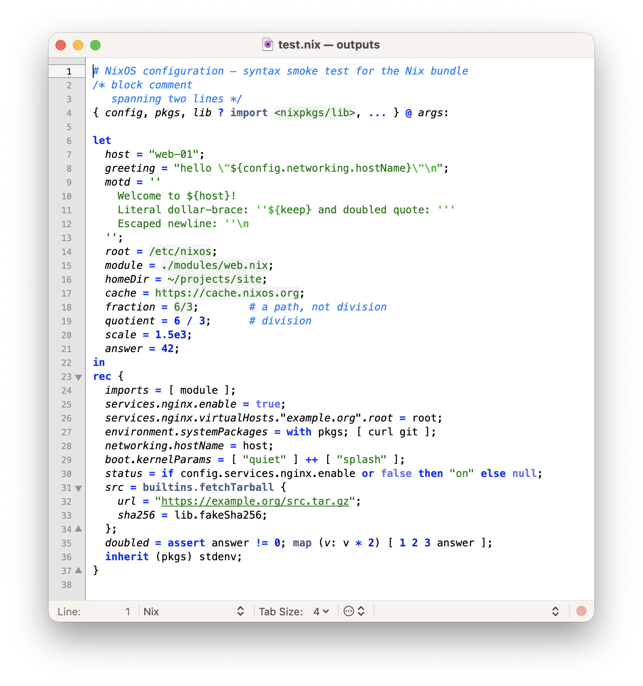

# Nix.tmbundle

[TextMate 2](https://macromates.com) support for the [Nix expression language](https://nixos.org/manual/nix/stable/language/) - the `.nix` files used by NixOS, nix-darwin, Home Manager and the Nix package manager.

## Features

* Grammar (`source.nix`): line/block comments, double-quoted and `''`-indented strings with `${...}` interpolation (including the `''${`, `'''` and `''\`
  escapes), paths, home paths, `<search-paths>` and unquoted URLs, keywords (`let`, `in`, `with`, `if`/`then`/`else`, `assert`, `rec`, `inherit`, `or`),
  the global builtins and `builtins.*`, attribute-path definitions  (`services.nginx.enable = ...`), function parameters, integers and floats,
  and all operators.
* `⌘/` comment toggling (`#` and `/* ... */`).
* Smart typing pairs and brace-match highlighting.



## Installation

Either double-click `Nix.tmbundle`, or clone straight into TextMate's bundle directory:

```
mkdir -p ~/Library/Application\ Support/TextMate/Bundles
cd ~/Library/Application\ Support/TextMate/Bundles
git clone https://github.com/bougakov/nix.tmbundle.git
```

TextMate picks the bundle up automatically; `.nix` files are then highlighted out of the box.

## Contributing

Bug reports and pull requests are welcome via this repo. Please include a minimal `.nix` snippet that demonstrates any highlighting issue.

## License

GNU General Public License v3.0
